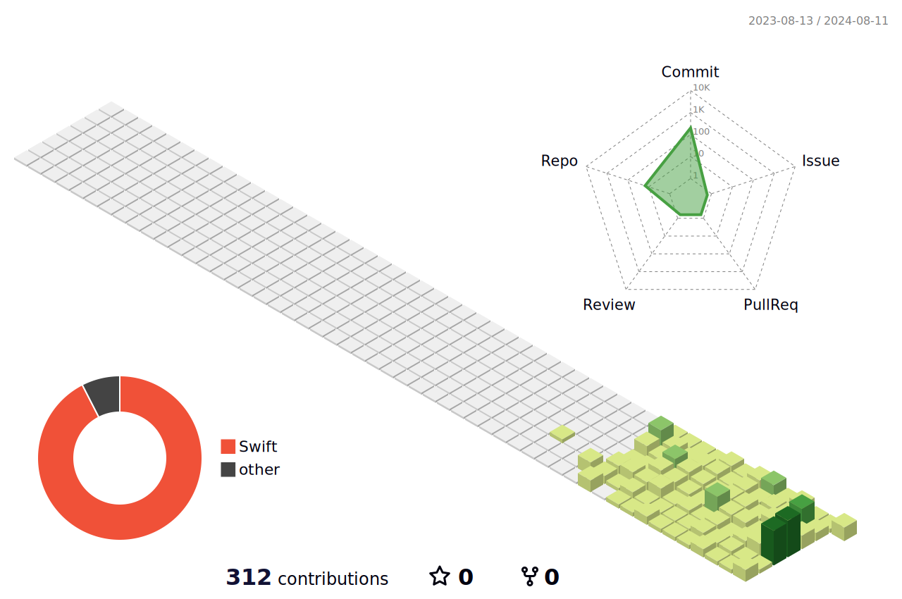

<h1 align="center">
  
</h1>
<h2 align="center" style="color: white; font-size: 25px; margin-top: -20px;">iOS Developer</h2>

<h3 align="center">✨ Tech Stack ✨</h3>

  
  

 

<h3 align="center">🛠 Tools 🛠</h3>

  
  
  

  
  
  

 

<h3 align="center">📫 Contact 📫</h3>

  &nbsp;
  

 

